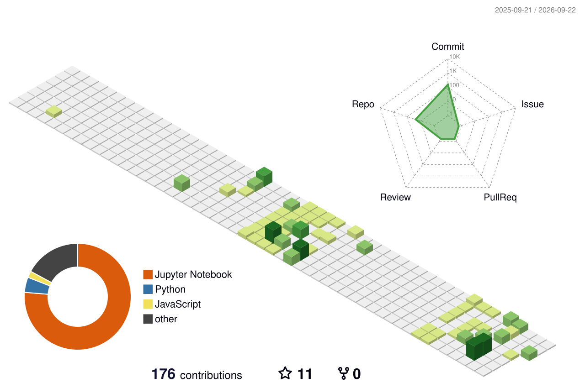

<h1 align="center">Hi there, I'm Hansini Bhavsar 👋</h1>

<p align="center">
  <strong>Aspiring Data Analyst | Python Developer | Data Enthusiast</strong>
</p>

<p align="center">
  
</p>

<p align="center">
  <a href="https://github.com/hansinibhavsar1715">
    
  </a>
  <a href="https://linkedin.com/in/hansini-bhavsar-a07111253">
    
  </a>
  <a href="mailto:hansinibhavsar@gmail.com">
    
  </a>
</p>

---

## 💫 About Me

* 🔭 Currently sharpening my skills in **Data Analysis, Python, Pandas, NumPy & Data Visualization**
* 🌱 Learning **Advanced SQL, Power BI, Streamlit & Machine Learning fundamentals**
* 📊 Interested in **EDA, data cleaning, validation, dashboards & data storytelling**
* ⚙️ Exploring **API-based data collection and automation**
* 💡 Passionate about turning **raw data into meaningful insights**
* 🎯 Actively seeking opportunities as a **Data Analyst / Python Developer**
* 📫 Reach me at **[hansinibhavsar@gmail.com](mailto:hansinibhavsar@gmail.com)**

---

## 🛠️ Tech Stack

### 💻 Languages


### 📊 Data & Machine Learning


### 📈 Visualization & BI


### 🗄️ Databases


### ☁️ Cloud & Tools


---

## 📊 GitHub Analytics

<p align="center">
  
  
</p>

<p align="center">
  
</p>

---

## 📈 Contribution Activity

<p align="center">

  <a href="https://github.com/hansinibhavsar1715">
    
  </a>

</p>

<p align="center">
  <i>Learning • Building • Contributing • Growing</i>
</p>


## 🏆 GitHub Achievements

<p align="center">
  
</p>

<p align="center">
  <i>Building consistently. Learning continuously. Growing one contribution at a time.</i>
</p>
## 🚀 Featured Projects

<table>
<tr>
<td width="50%">

### ❤️ Heart Disease Diagnosis

Machine Learning and Data Mining project focused on analyzing data and exploring predictive patterns.

**Python • Pandas • ML • Data Mining**

<a href="https://github.com/hansinibhavsar1715/Heart_Disease_Diagnosis_Using_ML_and_Data_Mining_Main">
View Repository →
</a>

</td>

<td width="50%">

### 🏏 Cricket Performance Dashboard

Interactive dashboard focused on cricket performance, player statistics and data-driven insights.

**Power BI • Data Visualization • Analytics**

<a href="https://github.com/hansinibhavsar1715/Cricket_Performance_and_Player_Insights_Dashboard">
View Repository →
</a>

</td>
</tr>

<tr>
<td width="50%">

### 📊 Seaborn Visualizations

A collection of Python-based statistical visualizations created while exploring data visualization and EDA.

**Python • Seaborn • Visualization**

<a href="https://github.com/hansinibhavsar1715/Seaborn-plots">
View Repository →
</a>

</td>

<td width="50%">

### 🧩 Sorting Techniques

Python implementations of sorting algorithms designed to strengthen algorithmic thinking and problem-solving.

**Python • Algorithms • Problem Solving**

<a href="https://github.com/hansinibhavsar1715/Sorting_Techniques_in_python">
View Repository →
</a>

</td>
</tr>
</table>

<p align="center">
  <a href="https://github.com/hansinibhavsar1715?tab=repositories">
    
  </a>
</p>

---

## 🎯 Data Analyst Focus

<p align="center">


</p>

---

## 🐍 Contribution Snake

<p align="center">
  <picture>
    <source media="(prefers-color-scheme: dark)" srcset="https://raw.githubusercontent.com/hansinibhavsar1715/hansinibhavsar1715/output/github-contribution-grid-snake-dark.svg">
    <source media="(prefers-color-scheme: light)" srcset="https://raw.githubusercontent.com/hansinibhavsar1715/hansinibhavsar1715/output/github-contribution-grid-snake.svg">
    
  </picture>
</p>

---

## 🧊 3D Contribution Graph

<p align="center">
  
</p>

---

## 📚 Currently Learning

```text
Python
  ├── Data Analysis
  ├── Pandas / NumPy
  ├── Data Visualization
  └── Automation

SQL
  ├── Joins
  ├── Subqueries
  ├── Window Functions
  └── Advanced Analytics

BI & Applications
  ├── Power BI
  ├── Streamlit
  └── Interactive Dashboards

Machine Learning
  ├── Feature Engineering
  ├── Model Evaluation
  └── Predictive Analytics
```

---

## 💡 What I Like Building

* 📊 Data analysis projects using real-world datasets
* 🔎 Exploratory Data Analysis and data storytelling
* 🗄️ SQL analytics and database-driven projects
* 📈 Interactive Power BI dashboards
* 🌐 Streamlit applications
* 🔌 API-based data collection
* ⚙️ Automated data workflows
* 🔮 Forecasting and predictive analytics
* 🤖 Practical Machine Learning projects

---

## 📌 My Development Philosophy

> **Learn → Build → Analyze → Improve → Repeat**

I believe the best way to learn technology is by building projects, working with real data and continuously improving the solution.

---

## 🤝 Let's Connect

<p align="center">

<a href="https://linkedin.com/in/hansini-bhavsar-a07111253">

</a>

<a href="mailto:hansinibhavsar@gmail.com">

</a>

<a href="https://github.com/hansinibhavsar1715">

</a>

</p>

---

<p align="center">
  
</p>

<p align="center">
  <i>Thanks for stopping by! 🚀</i>
</p>

<p align="center">
  <strong>Turning data into insights, one project at a time.</strong>
</p>
